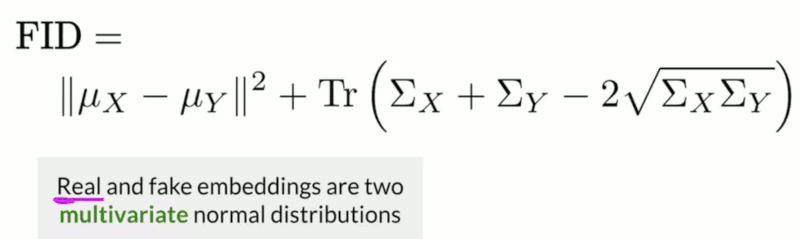

# Build Better GANs

## Week1  Evaluation of GANs

- Challenging to evaluate GANs
    - There is no universal gold-standard discriminator. A discriminator cannot be used for evaluation because it overfits to the generator it's trained with. 
- How to envaluate GANs ?
    - two important properties
        1. **Fidelity**  ( quality of images )
            - how realistic your images are looking from you GAN
        2. **Diversity** ( variety of images )
            - you want the generated images to cover the whole diversity, the variety of the real distribution
            - if a GAN is only generating the same single image, but it's very realistic, that's not a well performing model

---

- Comparing Images
    - Pixel distance
        - matrix subtraction,  but what if switch 2 channels ?
        - simple, but unreliable
    - Feature distance
        - e.g. 2 images of dog , comparing features is saying 2 eyes, 2 droopy ears, 1 nose , ...
        - use the higher level features of an image, making it more reliable

---

- Feature Extraction
    - you can get a feature extractor by taking the weights of a pre-trained classifier
        - you can usually lobby off  the last fully connected layer, the last pooling layers is most commonly used for feature extraction
    - ImageNet dataset
        - more than 14,000,000 images and 20,000 categories
        - best to use classifiers that have been trained on large datasets
    - these features are called **embedding**

---

- Inception-v3 and Embeddings
    - Inception-v3
        - an intricate convolutional neural network classifier that can be trained on imagenet. 
        - This section is about the Inception-v3 network, how to extract feature embeddings from it, and then compare those embeddings. This comparison can be used to evaluate GANs. 
        - 
        - the classification is happening way out the screen ( behind the Output ), and that had been already cut-off
        - you get 8x8x2048 output, this is you get out of last convolutional layer. and then you put this into you last pooling layer with 8x8 filter, and you get an embedding vector, of size 2048. and what's amazing is that you only get these 2048 values as your output. and this means that given an image, it can condense the pixels of the image to just 2048 values to represent the salient features from that image.
        - I keep saying 2048 because it's really not a lot of values.


---

- Fréchet Inception Distance (FID)
    - the most popular metric for measuring the feature distance between real and generated images
    - 
    - lower FID = closer distributions
    - use large sample size to reduce noise , e.g. 50,000 samples
- Shortcomings of FID
    - Uses pre-trained Inception model, which may not capture all features
    - Needs a large sample size
    - slow to run
    - Limited statistics used: only mean and covariance

---

- Another evaluation metric: Inception Score (IS)
    - 
    - 
    - Shortcomings of IS
        - Can be exploited or gamed
            - Generate one realistic image of each class
        - Only looks at fake images
            - No comparison to real images
        - Can miss useful features
            - ImageNet isn't everything
    - Worse than Fréchet Inception Distance

[A Closer Look at Inception Score](pdfs/1801.01973.pdf)

---

- Sampling and Truncation
    - Fakes are sampled using the training or prior distribution of z
    - Truncate
        - By sampling at **test** time from a normal distribution with its tails clipped.
        - Truncate more for higher fidelity, lower diversity
    - Human evaluation if still necessary for sampling

[(Optional) HYPE!!](pdfs/1904.01121.pdf)


---

- Precision and Recall
    - Precision is to fidelity as to recall is to diversity
    - Models tend to be better at recall
    - Use truncation trick to imporove precision

[(Optional) More on Precision and Recall](pdfs/1904.06991.pdf)


---

[Lab: (Optional) Perceptual Path Length](https://www.coursera.org/learn/build-better-generative-adversarial-networks-gans/ungradedLab/BQjUq/optional-perceptual-path-length/lab)


## Week2 GAN Disadvantages and Bias

- Disadvantages of GANs
    - Lack of intrinsic evaluation metrics
    - Unstable training
    - No density estimation
    - Inverting is not straightforward
- Alternatives to GANs
    - VAEs ( Variational Autoencoders)
    - What is the core difference between GANs and VAEs?
        - VAEs use autoencoders to encode a real image and then decode them while GAN generators never see the real image in any form.

Advantags | Disadvantages
--- | ---
Has density estimation | Lower quality results
Invertible | 
Stable training | 


[Lab: VAEs](https://www.coursera.org/learn/build-better-generative-adversarial-networks-gans/ungradedLab/bKSQx/alternatives-variational-autoencoders-vaes/lab)

---

- Fairness in Machine Learning
    - difficult to define
    - there is no single definition of fairness
    - important to explore these before releasing a system into production


## Week3 StyleGAN and Advancements

- GAN Improvements
    - Stability - longer training and better images
        - Use moving average for smoother results
            - take averages of the weights of generator at different iterations
        - progressive growing
            - gradually trains GAN at increasing resolutions
    - Capacity - Larger models can use higher resolution images
    - Diversity - increasing variety in generated images

---

- StyleGAN Overview
    - StyleGAN Goals
        - Greater fidelity on high-resolution images
        - Increased diversity of outputs
        - More control over image features
    - Style in GANs
        - Can be any variation in the image, from larger, coarser styles to finer, more detailed styles
- The Sytle-Based Generator
    ```
    noise vector: z → Mapping Network → Intermediate noise: w → StyleGAN Generator → output
                                                 random noise ➚
    ```
- Progressive Growing
    - during the training process, both the generator and discriminator start with a small low resolution image. 
    - And the goal servers trained the generator to be able to generate something easier than a high resolution face, 
    - when the models are stable, they can then double the height and width. 
    - And this continues until the desired image resolution is reached. 
    - The doubling can't be too abrupt, but must be more gradual in order to ease the generator into generating those larger images. 

---


